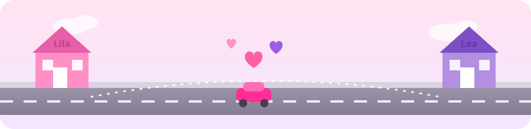

<p align="center">
  
</p>

<h1 align="center">🌷 Polly das Esquinas 💜</h1>

<p align="center">
  <em>(outros nomes que consideramos: "Lila & Lea: Aventura na Cidade", "Polly do Encontro")</em>
</p>

<p align="center">
  <b>G39</b> · Conteúdo da Disciplina: <b>Grafos 1</b>
</p>

<p align="center">
  
  
  
</p>

---

## 👩‍🎓 Alunos

| Matrícula | Aluno |
|:---:|:---|
| `-` | _(preencher)_ |
| `-` | _(preencher)_ |

---

## 💌 Sobre

**Polly das Esquinas** é um jogo baseado no clássico jogo de tabuleiro da Polly de carrinho, reimaginado como um problema de grafos.

A história: **Lila** sai de casa dirigindo pelas ruas da cidade em busca da sua amiga **Lea**. Assim que as duas se encontram, elas seguem juntas até um destino sorteado entre 4 lugares possíveis: 🏦 banco, 🌳 parque, 🏢 prédio ou 🏀 quadra de esportes. Só que nem toda rua é tranquila — algumas têm obstáculos (🌪️ tornado, 🛢️ óleo, 📌 pregos, 🟤 lama) que tornam o trajeto mais demorado.

### 🗺️ Como o grafo é modelado

- **Nós** → esquinas da cidade (uma grade de 32 esquinas, 8 colunas × 4 linhas).
- **Arestas** → ruas que ligam esquinas vizinhas (o grafo não é direcionado: toda rua pode ser percorrida nos dois sentidos).
- **Pesos** → o "custo" de atravessar cada rua. Ruas livres custam `1`; ruas com obstáculo custam mais (`tornado = 7`, `óleo = 5`, `pregos = 3`, `lama = 8`), simulando o tempo extra que cada imprevisto causa.

O grafo é **cíclico** (é uma malha de quadras, não uma árvore) e sempre totalmente conexo, já que é gerado a partir de uma grade regular.

### 🧭 Por que Dijkstra?

O problema do jogo é, no fundo, sempre o mesmo: **dado um ponto de partida e um ponto de chegada, qual é o caminho de menor custo entre eles, considerando os obstáculos pelo caminho?** Como todos os pesos são positivos (nenhuma rua "desconta" tempo), o algoritmo de **Dijkstra** é a escolha natural — ele garante o caminho ótimo nesse cenário, com uma complexidade muito mais eficiente do que testar todas as rotas possíveis.

Como a jornada tem **3 pontos**, não 2 (a casa da Lila → a casa da Lea → o destino sorteado), o Dijkstra roda **duas vezes por partida**:

1. 🚗 **Trecho 1:** da casa da Lila até a casa da Lea.
2. 🚗💜 **Trecho 2:** da casa da Lea até o destino sorteado (com as duas já juntas).

O custo total do desafio é a soma dos dois trechos, e é contra esse valor que o desempenho do jogador é comparado no final.

---

## 📸 Screenshots

> ⚠️ As imagens abaixo ainda são placeholders — falta adicionar os prints de tela reais do jogo rodando.

<p align="center">
  
  
  
</p>

<p align="center">
  <sub>Tela inicial · Tela durante o jogo · Tela de chegada/vitória</sub>
</p>

---

## 🎬 Vídeo de Apresentação

📺 [Assista aqui](https://www.youtube.com/watch?v=SEU_VIDEO_AQUI) _(link a ser atualizado)_

---

## ⚙️ Instalação

### Pré-requisitos

- [Git](https://git-scm.com/)
- Um navegador (Chrome, Firefox, etc.) — não é necessário instalar nenhum servidor, framework ou dependência.

### Passo a passo

```bash
git clone git@github.com:projeto-de-algoritmos-2026/G39_Grafos_PA-26.2.git
cd G39_Grafos_PA-26.2
```

Depois, basta abrir o arquivo `layout-rascunho.html` direto no navegador (duplo clique nele, ou `open layout-rascunho.html` no terminal) — é só HTML/JS/SVG puro, sem build e sem servidor.

> 💡 Se quiser regenerar a cidade (pesos das ruas), rode `python3 grafo.py` antes de abrir a página — isso reescreve o arquivo `dados.js` usado pelo jogo. Isso é opcional: a cidade fixa (esquinas e ruas) já vem pronta no repositório.

---

## 🕹️ Uso

1. Abra `layout-rascunho.html` no navegador. O carrinho da Lila 🚗💗 aparece já posicionado na casinha rosa dela.
2. Clique em um nó **vizinho** ao nó onde o carrinho está agora para mover a Lila até lá. Não dá pra "pular" direto pra qualquer esquina do mapa — só pelas ruas, uma de cada vez.
3. Cada clique válido soma o custo daquela rua (mais caro se ela tiver um obstáculo) e registra o trajeto percorrido.
4. Quando a Lila chegar na casinha roxa da Lea 💜, aparece uma mensagem de encontro e o carro roxo da Lea passa a acompanhar, sempre um nó atrás do carrinho da Lila.
5. A missão então muda: chegar ao lugar sorteado (banco, parque, prédio ou quadra de esportes) — o quarteirão de destino é o único do mapa com aquela imagem específica.
6. Ao chegar no destino, o jogo mostra: o caminho completo que você percorreu, o custo total do seu trajeto, o custo do caminho ótimo (calculado via Dijkstra) e a diferença entre os dois — te dizendo se você encontrou a rota mais rápida ou ficou acima do ideal.

---

## ✨ Outros

- Cada partida é diferente: a posição da casa da Lila, da casa da Lea e o destino sorteado mudam a cada vez que a página é carregada — assim como quais ruas têm obstáculos.
- É permitido "voltar" para um nó já visitado (o jogo não bloqueia retrocessos) — só que isso custa mais, já que a rua é percorrida de novo.
- Partida e ponto de encontro (e ponto de encontro e destino) são sempre sorteados a uma distância mínima um do outro (em número de ruas), pra garantir que o desafio nunca seja trivial demais.
- O destino sorteado nunca aparece decorando nenhum outro quarteirão do mapa naquela partida — ele é exclusivo do nó de chegada.

<p align="center">🌷💜🚗 boa sorte, e até a próxima esquina! 🚗💜🌷</p>
